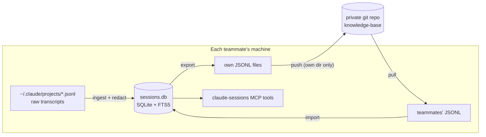

# claude-session-central

Design and implementation plan for a team-wide Claude Code session knowledge base,
built on this plugin's bundled `claude-session-cache` MCP server.

- **Status:** implemented in the plugin and its bundled MCP server (schema v4,
  `export`/`import`/`sync` CLI, tombstones, scope-aware search, launchd agent,
  settings UI). Still to do: create the private repo, its CI, `setup.sh`,
  `policy.md`, and run the pilot.
- **Date:** 2026-08-14, implemented 2026-08-15. Merges two planning passes: the
  architecture session (schema, export/import, sync mechanics) and a follow-up
  review that added the deletion model, secret-scanning layers, cadence hardening,
  and rollout plan.
- **Scale target:** one backend team (~10 people), 2–3 shared projects. The design
  deliberately trades generality for zero new infrastructure at this scale.

---

## Goal

Anyone on the team can ask Claude "what did we decide about X", "who touched this
file and why", or "what shipped on this branch" — and get answers from the **whole
team's** session history, not just their own machine.

Each person already has a local, searchable session index (SQLite + FTS5, built by
this repo's MCP server). This plan extends that index to hold teammates' sessions
too, synced through a private git repository — no new servers, no new query surface.

## Non-goals

- Not a real-time system. Twice-daily sync is the contract; staleness is visible,
  not hidden.
- Not a shared backend. No Postgres, no hosted service. Revisit only past ~30–50
  people (see *Rejected alternatives*).
- Not a replacement for code review, docs, or commit messages. It is recall
  infrastructure, not a source of truth.
- Personal and other-client projects never sync. Export is allowlist-only.

---

## Architecture overview

The SQLite database file never leaves any machine. Only redacted JSONL text crosses
the boundary, through a private git repo, at paths only one person ever writes.



**Why not sync `sessions.db` directly:** the cache runs `PRAGMA journal_mode=WAL`
(`mcp-server/src/claude_session_cache/db.py`). WAL splits state across the main
file plus `-wal`/`-shm` companions and relies on POSIX locking — a file-level copy
can silently miss not-yet-checkpointed rows or fail to open, even with no concurrent
writer. On top of that, git cannot merge a binary file, so the second pusher of the
day clobbers the first. Sync text, keep the database local.

## Knowledge-base repo layout

One path per person per project. Two people's pushes never touch the same file, so
merge conflicts are impossible by construction.

```
knowledge-base/
  <project_name>/
    <owner-email>/
      <session_id>.jsonl    # one file per session: header + redacted messages
      deletions.jsonl       # tombstones: sessions this owner has retracted
  policy.md                 # the one-page team policy (see Onboarding)
  setup.sh                  # one-command onboarding
  .github/workflows/ci.yml  # secret scan + ownership + format checks
```

One file **per session**, not per day (a change from the first draft): a session
that gains messages across days would leave stale duplicate copies in older day
files, while per-session files make skip-if-unchanged, re-export, and
tombstone-deletion trivial — the file is rewritten or removed in place.

- `<project_name>` is the cache's existing grouping key — it already collapses
  different absolute checkout paths to the same value, which is what makes "the
  same project on ten machines" line up.
- `<owner-email>` comes from `git config user.email` — already set and team-unique
  for everyone.
- `session_id` is a Claude-generated UUID and already the primary key, so rows are
  globally unique across machines with no new id scheme.

---

## Schema change (v3 → v4)

One new column: `sessions.owner TEXT` — `NULL` means "mine", an email means "the
teammate this row was imported from". Applied via the existing
`_add_column_if_missing` migration pattern in `db.py`.

**The `all_accounts` trap — do not overload it.** The existing
`source_root`/`all_accounts` concept means "which of *my own* Claude accounts on
this machine". Reusing that flag for teammates would silently conflate "my other
account" with "the whole team" under one boolean. `owner` is an independent axis:

- `source_root` → which of my accounts (existing, unchanged)
- `owner` / `scope` → whose sessions: `mine` (default) · `team` · a specific email

`_account_clause` in `queries.py` gains this second dimension; it is threaded
through the query tools (`search_sessions`, `list_sessions`, `get_session`,
`sessions_touching_file`, `find_commits`) as an optional `scope` parameter, and
every team-scoped result carries owner attribution so "who said this" is always
visible.

---

## Components

### 1. `export` (new CLI subcommand)

Reads from the local cache — messages were already redacted at ingest by
`redact.py`, so no new redaction logic — and writes the day's JSONL under the
owner's own directory.

- `export --since <watermark> [--project <name>...]` — incremental, driven by the
  same watermark idea ingest already uses.
- **Allowlist-only:** a project exports only if it appears in the configured
  project allowlist. Nothing exports by default — scratch projects and other-client
  work stay local.
- **Enforces `excludeFromSync`:** a session marked private never leaves the
  machine. This wires up the already-shipped toggle — build this check first so the
  toggle stops being a stored-but-ignored flag.
- **Deterministic and idempotent:** re-running with no new data produces no diff,
  so the sync job can run any number of times safely.

### 2. Deletion model (tombstones)

Marking a session private *after* it has synced must actually retract it —
otherwise the privacy toggle silently lies for anything already exported.

- Export detects sessions now flagged `excludeFromSync` that were previously
  exported, **deletes their exported files** (allowed: each owner is the only
  writer of their directory), and appends a tombstone
  (`{"session_id": ..., "deleted_at": ...}`) to `deletions.jsonl`.
- Import replays tombstones and deletes those sessions from the local cache
  (`ON DELETE CASCADE` clears messages, files, tags, commits; FTS triggers clean
  the index).
- **Honest limit:** git history still holds the old blob. Tombstones handle the
  routine case (retracting something merely irrelevant or private). A genuinely
  leaked secret needs credential rotation plus a history rewrite — the policy doc
  says exactly this, so nobody assumes tombstones are a security eraser.

### 3. `import` (new CLI subcommand)

- `import <glob>` upserts pulled JSONL into the **same** local
  `sessions`/`messages` tables (`INSERT ... ON CONFLICT` by `session_id`), stamping
  `owner` from the file path. Same schema, same FTS5, same tools.
- **Skips files whose owner is the local identity** — the local rows are the
  richer originals; never overwrite them with their own redacted exports.
- Applies tombstones after upserting.
- Idempotent: importing the same files twice is a no-op.

### 4. The sync job

One script, one behavior, safe to run at any moment:

```
git pull --rebase  →  import  →  export  →  secret scan (gitleaks)  →  commit + push
```

- Scheduled **twice daily** (hours configurable in the plugin's settings, default
  9 and 18) via the plugin's existing
  launchd plist generator (`McpRuntime.installRefreshAgent()` grows two scheduled
  blocks). No new scheduling infrastructure.
- **Why not "push at 23:00, pull at 07:00":** launchd fires a missed calendar job
  once on wake, but not if the laptop stayed shut past both times or was off.
  Because every step above is idempotent, running the whole cycle at both ticks is
  strictly more robust than orchestrating separate push and pull times — a missed
  run means slightly staler data, never corruption or conflict.
- The push only ever adds/rewrites files under the runner's own `<owner-email>/`
  directories.

### 5. MCP tool surface

- `scope` parameter on the five query tools (default `mine` — a solo user's
  behavior is unchanged until they opt in).
- Owner attribution in team-scoped results.
- **Staleness visibility:** `cache_stats` reports last-synced time per owner
  ("last import from X: 2 days ago"), so a sleeping laptop or an offline teammate
  is visible instead of silently missing.
- **Team digest (nice-to-have):** a `digest --since-days 1 --all-owners` command —
  "what did the team ship yesterday", grouped by project and owner — nearly free
  given `list_sessions` already supports `since_days`.

### 6. Plugin (Kotlin) surface

- Settings additions: owner identity (prefilled from `git config user.email`),
  project allowlist, sync on/off.
- "Mark private" context-menu toggle: already shipped; export enforcement makes it
  real.
- (Later, optional) show team sessions read-only in the browser panel — explicitly
  out of scope for v1; the MCP search surface is the deliverable.

---

## Security & privacy

Layered, because `redact.py` is **shape-based**: it catches known secret shapes
(private keys, `sk-`/`ghp_`/`xox`/AKIA tokens, JWTs, DB-URL credentials,
`SECRET=`-style assignments) but cannot catch a credential that doesn't look like
one, proprietary business logic, or customer data in tool output.

| Layer | What it catches | Where |
|---|---|---|
| Redaction at ingest (`redact.py`) | Known secret shapes, before anything touches disk | each machine |
| `excludeFromSync` + tombstones | Whole sessions a person chooses to withhold or retract | each machine |
| Project allowlist | Entire projects that must never sync | each machine |
| `gitleaks` in the sync script | Shape-based leaks that survived redaction, **before** push | each machine |
| CI on the knowledge-base repo | Secret scan on every push; alerts the team | repo |
| CI ownership check | A push that touches files outside the pusher's own `<owner-email>/` directory | repo |
| CI format check | Malformed JSONL that would poison ten imports | repo |
| Private, org-owned repo | Everything above failing | hosting |

Access framing for the policy doc: **read access to this repo is equivalent to read
access to everyone's shell history.** Org-owned, private, team-only.

Trade-off, decided consciously: pushes go **directly to main** (requiring PRs for a
twice-daily bot push adds friction that would kill adoption); CI is therefore a
*detective* control that alerts, while the local pre-push gitleaks gate is the
*preventive* one. If a violation alert ever fires, the response runbook is in the
policy doc (rotate, rewrite history, re-pull).

---

## Onboarding

Adoption across ten people is a people problem; the budget for setup is one command
and one page.

- **`setup.sh`** in the knowledge-base repo: clones/locates the repo, writes the
  owner identity and allowlist into the plugin/MCP config, installs the launchd sync
  job, runs one initial pull+import. Plugin installs/updates are already solved by
  the custom plugin repository (`updatePlugins.xml`).
- **`policy.md`** (one page, no more): what syncs (allowlisted projects only), how
  to mark a session private and what tombstones do/don't erase, the git-history
  caveat, who has repo access, and the leak-response runbook.

## Rollout

1. **Pilot:** one project, 2–3 people, one week. Success = a real cross-person
   question answered via `search_sessions scope=team`, zero CI alerts, sync visible
   in `cache_stats` for all pilots.
2. **Team:** remaining people onboard via `setup.sh`; add the second/third project
   to the allowlist per the pilot's verdict.
3. **Review after a month:** repo growth rate, search hit quality, any redaction
   near-misses. Decide then whether the digest command and read-only team browsing
   are worth building.

---

## Build order

Each step is shippable alone; nothing later blocks anything earlier.
Steps 1–5 shipped 2026-08-15; step 6 onward is open.

1. **Schema v4** — `owner` column via `_add_column_if_missing`.
   *Accept:* existing databases migrate in place; all existing queries behave
   identically with `owner IS NULL`.
2. **`export`** — allowlist, watermark, `excludeFromSync` enforcement, tombstone
   emission, own-file rewrite.
   *Accept:* private sessions never appear in output; re-run with no new data
   produces no diff; flipping a synced session to private yields a tombstone and a
   rewritten day-file.
3. **`import`** — upsert, self-skip, tombstone replay.
   *Accept:* double-import is a no-op; imported text is FTS-searchable; tombstoned
   sessions vanish locally.
4. **`scope` in `queries.py` + the five query tools**, owner attribution,
   `cache_stats` staleness.
   *Accept:* default behavior unchanged; `scope=team` returns attributed rows.
5. **Sync script + launchd wiring + plugin settings** (identity, allowlist,
   on/off).
   *Accept:* full cycle runs unattended twice daily; missed runs recover on the
   next tick.
6. **Knowledge-base repo**: CI (secret scan, ownership, format), `setup.sh`,
   `policy.md`.
7. **Pilot → rollout** (above).
8. Nice-to-haves as demand proves out: team digest command, read-only team sessions
   in the browser panel.

---

## Rejected alternatives

- **Shared backend (Postgres / Turso / internal server).** More correct in the
  abstract; new infrastructure to run, secure, and pay for, for ten people who
  already have git auth and a launchd pattern. Revisit past ~30–50 people.
- **Syncing the SQLite file.** See *Architecture overview* — WAL + binary merge
  make this the worst option, not a shortcut.
- **AI-summarized digests instead of full redacted bodies.** The entire MCP tool
  surface is built around full-text search over message bodies; a metadata-only
  digest would gut `search_sessions` for team scope. A one-paragraph summary is a
  potential value-add *column*, never the payload.
- **GitHub Discussions/Issues as the store.** API rate limits and auth complexity
  for no benefit over files already being pulled.
- **CI-side pre-merge into one consolidated artifact.** Merging ten people's JSONL
  locally is milliseconds; a pipeline isn't worth it at this scale. Named as the
  natural next step if team or project count grows a lot.

## Risks

| Risk | Mitigation |
|---|---|
| Secret survives shape-based redaction | gitleaks pre-push + CI scan + private org repo + rotation runbook |
| Person A's push damages person B's data | one-writer-per-path layout + CI ownership check |
| Privacy toggle flipped after sync does nothing | tombstones + exported-file deletion (built into `export`) |
| Laptop asleep at sync time | idempotent full-cycle job at two ticks; staleness visible in `cache_stats` |
| Repo grows without bound | plain text packs well in git; monitor at the one-month review; rollup/shallow-clone as the escape hatch |
| Setup friction stalls adoption | `setup.sh` + auto-updating plugin repo; pilot before rollout |
| "My other account" conflated with "the team" | `owner`/`scope` kept a separate axis from `source_root`/`all_accounts` |

## Open decisions (owner: team lead)

1. Which of the 2–3 projects are on the initial allowlist, and which pilots first.
2. Where the private repo lives (org account) and who gets access.
3. The two daily sync times.
4. Whether CI alerting posts to the team channel or just fails visibly in the repo.
