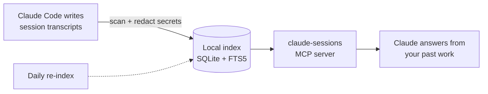
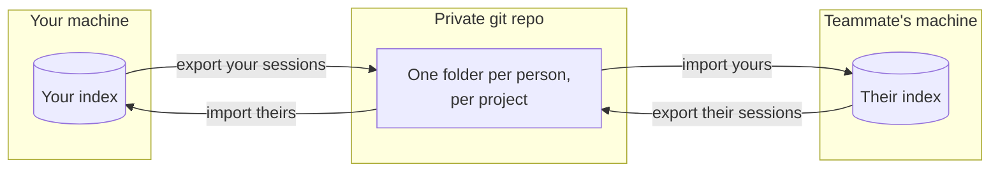
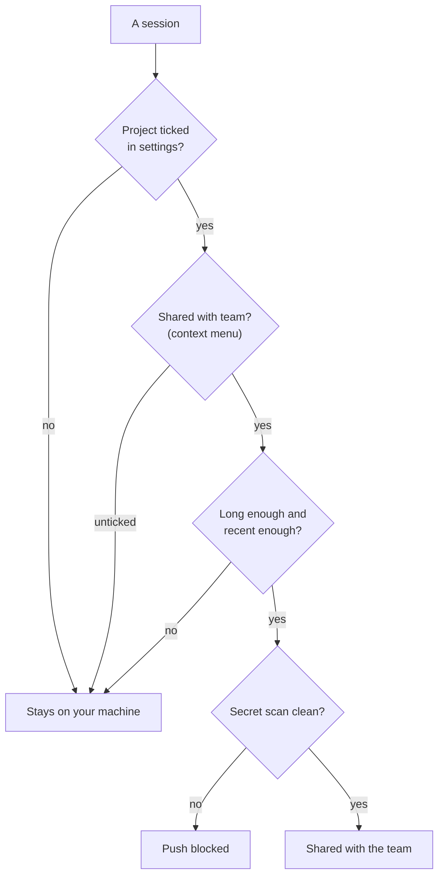
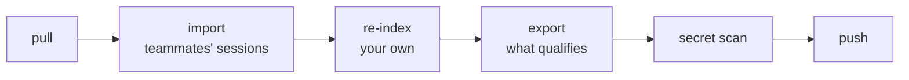

# Claude Session Browser

A PyCharm / IntelliJ plugin that puts **every Claude Code session on your machine** in a
left-hand tool window, grouped by project. Read a session's whole conversation as a
read-only transcript, resume it in a terminal tab, organise it with tags, see where your
time actually went — and optionally let Claude search your own history.

Current version: **1.2.0**. Built against IntelliJ IDEA Community 2025.2, compatible with
builds 242–299.\* (so it loads in PyCharm 2026.2, Community and Professional).

---

## What it does

### Browse and search

- Scans the selected account's `projects/*/*.jsonl` — every Claude Code session it holds.
- Groups by project, with the currently-open project pinned to the top. Pinned sessions
  sort above the rest, then newest first.
- Each row shows the session's title, then **relative time · model · message count ·
  git branch · tags**. The branch is always shown: it shortens
  (`feature/PROJ-1234-new-thing` → `PROJ-1234-new-thing`) rather than disappearing.
- **Search matches title, first prompt, project, git branch and tags** — including the
  auto-derived ticket id. Turn on **All** to search inside the message text too.
- Quick filters: All · Today · This week · Pinned · Untagged, from a dropdown beside the
  account picker. The **All** toggle sits with the search field, since that is what it widens.

### Read and resume

- **Double-click** a session → the transcript opens as an editor tab. Your turns and
  Claude's are on distinct cards with role badges; tool calls and results sit on a code
  surface in monospace.
- **Files touched** is a searchable dropdown — pick a file to copy its path, or ⌘-click
  several to copy them all.
- **The play button at the start of any row** resumes that session immediately
  (`claude --resume <id>`), no need to open it first. The transcript also has a
  **Continue session** button.
- Resume opens in the IDE's normal (reworked) terminal, so the tab looks and behaves like
  one you opened yourself. If launching ever fails, the command is copied to the clipboard.

### Organise

- Sessions **tag themselves**, free and instantly, with no AI call: the ticket id from the
  branch (`#proj-1234`) plus topics from the title (`#bugfix`, `#tests`, `#migration`,
  `#refactor`, `#review`, `#deploy`, `#ui`, `#api`, `#docs`, `#performance`, `#setup`,
  `#debug`).
- Add your own tags by hand, or use **Suggest tags (AI)** for one session (a single cheap
  Haiku call using only the title and first prompt — never the transcript).
- Rename or reset a title, pin a session, export a transcript to Markdown, delete one
  session or a whole multi-selection.

### Stats

A dashboard over your own history:

- **Activity** — a daily column chart for the last 14 days, with the busiest day, days
  worked, and the week-on-week change in messages.
- **Usage per account** — sessions, messages and prompt / output / cache-read tokens for
  each Claude account separately, never summed together.
- **Where the work went** — heaviest sessions, breakdowns by project, model, branch and
  tag, the files you keep returning to, and which tools and MCP servers do the work.
- **Claude memory** — how much of your history is searchable, commits produced, how fresh
  the index is.
- **Housekeeping** — sessions with two messages or fewer, and how many you've never tagged.

### Multiple Claude accounts

Define one **environment** per account and switch with the dropdown. Each carries its own
session directory and `CLAUDE_CONFIG_DIR`, so resuming, tagging and MCP registration all
act as that account.

Most second accounts need **only a config directory** — not a separate binary. If your
account switcher is a shell alias or function (e.g. one that sets `CLAUDE_CONFIG_DIR`),
leave the executable field blank and set the config directory instead; a shell function
cannot be launched as a program.

### Optional: let Claude search your sessions (MCP)

Tick **Settings → General → Let Claude search my past sessions**. One click extracts the
bundled `claude-session-cache` server,
builds it an isolated environment, indexes your history into SQLite + FTS5, registers it
with Claude Code, and schedules a daily re-index. Claude can then answer "what did we
decide about X" from your own past work.

- Searches stay **scoped to the account you have selected**.
- Secrets are redacted **on ingest**, so they never enter the database.
- Requires **Python 3.11+** on the machine, and internet access on the first run only.
  (macOS ships 3.9, which is too old — the plugin detects that and says so.)

How a question reaches your own history:



Nothing leaves the machine: the transcripts are only ever read, and the index is a file in
your home directory.

See [`mcp-server/README.md`](mcp-server/README.md) for the tools it exposes, the CLI, and
what gets indexed.

### Optional: share sessions with your team

**Settings → Team Sync** turns the personal cache into a team knowledge base: redacted
session history syncs through a **private git repository** (one directory per person per
project, so pushes can never conflict), and teammates' sessions are pulled back into your
local search. Claude can then answer with `scope: team` — "what did anyone on the team
decide about X", "who touched this file and why".



Because each person only ever writes inside their own folder, two people pushing at the
same time can never conflict.

- **Allowlisted projects only** — tick the projects to share; nothing else leaves the machine.
- **Share with team** sits on every session's context menu, ticked by default. Untick one to
  hold it back — and if it already synced, a tombstone retracts it from teammates' caches on
  their next pull.
- **Filters**: skip sessions under N messages (3 by default — throwaways carry no decision)
  and optionally anything older than N days. Tightening a filter retracts what a looser one
  already shared.
- **Pause sharing** with one click in the panel: your sessions stop being published, the
  team's keep arriving.
- **Your own redaction patterns** on top of the built-in ones, plus a notification when a
  scheduled sync fails.
- **Choose what Claude searches by default** — just your sessions, or the whole team's.
- A **status strip** under the toolbar shows the last run, what moved, and the countdown to
  the next one. One background job runs the full cycle (pull → import → export → push) twice a
  day and catches up at login if the laptop was asleep — the same job that keeps the search
  index current, so nothing is indexed twice. If `gitleaks` is installed, everything is
  secret-scanned again before each push.
- **Stats → Health** shows whether the background job, per-account MCP registrations and
  supporting tools are actually working.

Four gates decide whether a session ever leaves your machine — it has to pass all of them:



Untick **Share with team** on something already shared and the next run retracts it — the
file is deleted and a tombstone removes it from teammates' indexes too.

And what one scheduled run actually does:



Every step is safe to repeat, so a missed run just catches up at the next one.

Point the settings at the repo URL and local path, confirm your id (prefilled from
`git config user.email`), tick the projects to share, apply — cloning and scheduling
happen on their own.

---

## Install

1. PyCharm → **Settings → Plugins → ⚙ → Install Plugin from Disk…**
2. Pick `build/distributions/claude-session-browser-1.2.0.zip`.
3. **Restart** the IDE.
4. Open the **Claude Sessions** tool window on the left edge.

Nothing else to configure — it finds `claude` and your session directory on its own. Python
3.11+ only matters if you enable MCP.

### Get automatic updates (optional, one-time)

This plugin isn't on the JetBrains Marketplace, but it can still ride PyCharm's own update
mechanism via a custom plugin repository:

1. **Settings → Plugins → ⚙ → Manage Plugin Repositories → +**, and add:
   ```
   https://raw.githubusercontent.com/thanmay-strativ/claude-session-browser/main/updatePlugins.xml
   ```

From then on, PyCharm's normal **Check for Updates** finds new releases of this plugin,
downloads them and installs on restart — no repeating steps 1–3 above.

## Build

Requires a JDK 21 (set up with Homebrew's `openjdk@21`).

```bash
export JAVA_HOME=/opt/homebrew/opt/openjdk@21
./gradlew clean buildPlugin
```

The zip is written to `build/distributions/claude-session-browser-<version>.zip`, named
after `version` in `build.gradle.kts`.

To run a sandbox IDE with the plugin loaded:

```bash
export JAVA_HOME=/opt/homebrew/opt/openjdk@21
./gradlew runIde
```

## Development

Architecture, the full feature reference, the release checklist, the validated colour
palette, past bugs with their root causes, and the traps specific to this codebase are all
in **[`DEVELOPMENT.md`](DEVELOPMENT.md)**.

Two things worth knowing before you touch it:

- **Bump `build.gradle.kts` and `plugin.xml` together.** The version names the zip; the
  change-notes are what the user reads.
- **After changing anything in `mcp-server/`,** reinstall the plugin and restart. The plugin
  fingerprints the bundled Python by content and re-installs the on-disk server itself when
  the two differ — but that check runs when the tool window opens.

## Notes

- Uses only platform + bundled Terminal APIs, so it isn't tied to PyCharm's Python support.
- `claude` must be on the integrated terminal's `PATH` (or set an explicit executable per
  environment).
- Everything it writes lives outside the IDE config: `~/.claude-session-browser/` for
  metadata and the MCP server, `~/.claude-session-cache/` for the index. Your transcripts
  are only ever read.
